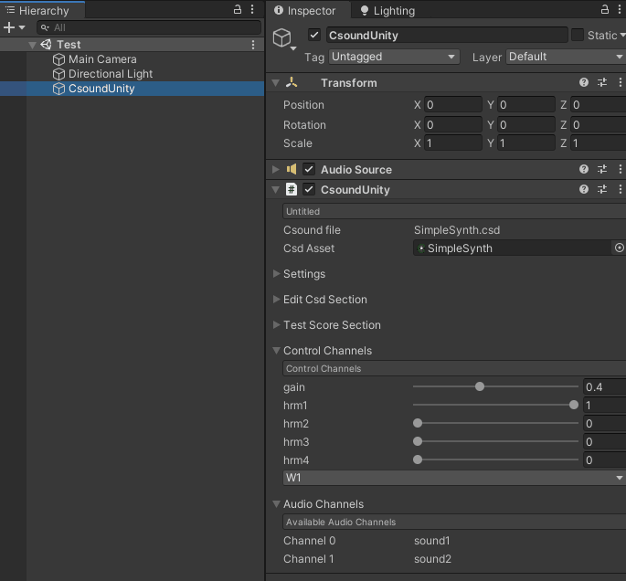

# CsoundUnityChild

New in version 3.0, the CsoundUnityChild component lets you read the AudioChannels found in a CsoundUnity instance. You can have as many audio channels you want in your Csd.
You can set them with the chnset opcode.
See the example below:
```csound
<Cabbage>
form caption("Test CsoundUnityChild") 
rslider channel("gain"), range(0, 1, .4, 1, .01), text("Gain")
rslider range(0, 1, 1, 1, 0.001), channel("hrm1")
rslider range(0, 1, 0, 1, 0.001), channel("hrm2")
rslider range(0, 1, 0, 1, 0.001), channel("hrm3")
rslider range(0, 1, 0, 1, 0.001), channel("hrm4")
</Cabbage>
<CsoundSynthesizer>
<CsOptions>
-n -d 
</CsOptions>
<CsInstruments>
; Initialize the global variables. 
ksmps = 32
nchnls = 2
0dbfs = 1

giWave1 ftgen 1, 0, 4096, 10, 1
giWave2 ftgen 1, 0, 4096, 10, 1, .5, .25, .17

;this instrument sends audio to two named channels
;this audio can be picked up by any CsoundUnityNode component..
instr ChildSounds
    a1 oscili 1, 440, giWave1
    chnset a1, "sound1"
    a2 oscili 1, 840, giWave1
    chnset a2, "sound2"
endin

</CsInstruments>
<CsScore>
;causes Csound to run for about 7000 years...
f0 z
i"ChildSounds" 0 z
</CsScore>
</CsoundSynthesizer>
```

To be able to pick those named channels, create a GameObject and add the CsoundUnityChild component. An AudioSource will be added if there is none.
There you can choose the AudioChannels that this CsoundUnityChild will play and in which configuration.
If AudioChannelsSetting is set to MONO, the selected AudioChannel will be played in both LEFT and RIGHT channel, at half volume, to have it perfectly centered.
If AudioChannelsSetting is set to STEREO, the selected AudioChannels will use the respective output channel.


